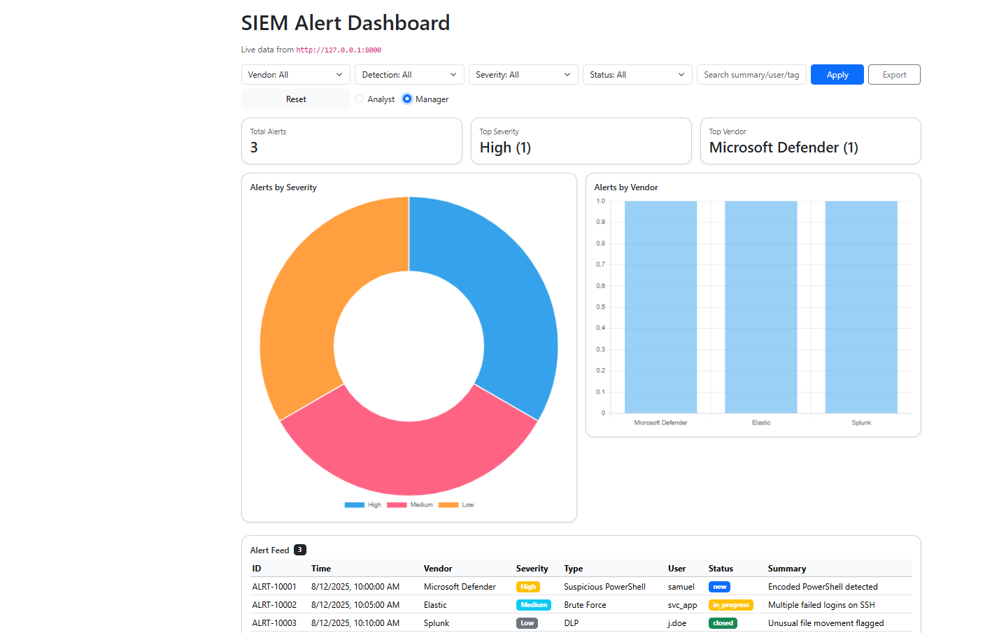
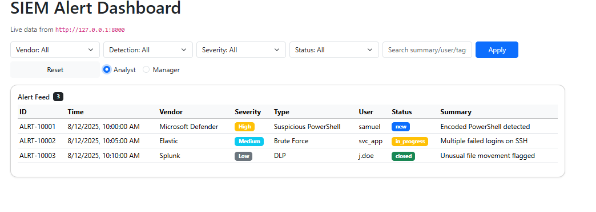

# 🛡️ SIEM Alert Dashboard

A lightweight, interactive Security Information and Event Management (SIEM) dashboard built with **FastAPI** (backend) and **Bootstrap + Chart.js** (frontend).  
It provides quick insights into alerts, severity levels, vendor distribution, and detailed filtering for SOC teams.

## 🚀 Features
- **Real-Time Alert Feed** — View alerts with timestamps, severity, vendor, detection type, and status.
- **Dynamic KPIs** — Auto-updating metrics for total alerts, top severity, and top vendor.
- **Interactive Charts** — Alerts by severity (doughnut chart) and vendor (bar chart).
- **Advanced Filtering** — Filter by vendor, detection type, severity, status, or free-text search.
- **Export to CSV** — Download filtered results instantly.
- **Role-Based View** — Manager vs. Analyst dashboard view (toggle in the UI).

---

## 📸 Screenshots
**Manager View**  
  

**Analyst View**  
  

---

## ⚙️ Installation & Setup

```bash
# Clone repository
git clone https://github.com/<your-username>/siem-alert-dashboard.git
cd siem-alert-dashboard

# Create virtual environment
python -m venv venv
venv\Scripts\activate  # Windows
source venv/bin/activate  # Linux/Mac

# Install dependencies
pip install -r requirements.txt
▶️ Running the App
Option 1: Manual Run
Backend

bash
Copy
Edit
cd backend
python -m uvicorn app:app --reload --port 8000
Frontend
Simply open frontend/index.html in your browser.

Option 2: One-Click Launch (Windows)
If you’re on Windows, you can use the provided run_dashboard.bat file for a one-click startup:

Double-click run_dashboard.bat.

This will:

Activate your Python virtual environment

Start the FastAPI backend on http://127.0.0.1:8000

Open the dashboard in your default browser

📂 Project Structure
pgsql
Copy
Edit
siem-alert-dashboard/
│   README.md
│   requirements.txt
│   run_dashboard.bat
│
├── backend/
│   └── app.py
│
├── frontend/
│   └── index.html
│
├── data/
│   └── sample_alerts.json
│
└── screenshots/
    ├── manager_view.png
    └── analyst_view.png
👨‍💻 Technologies Used
Backend: FastAPI, Python

Frontend: Bootstrap 5, Chart.js

Data: JSON

Version Control: Git/GitHub

📜 License
MIT License — free to use and modify.